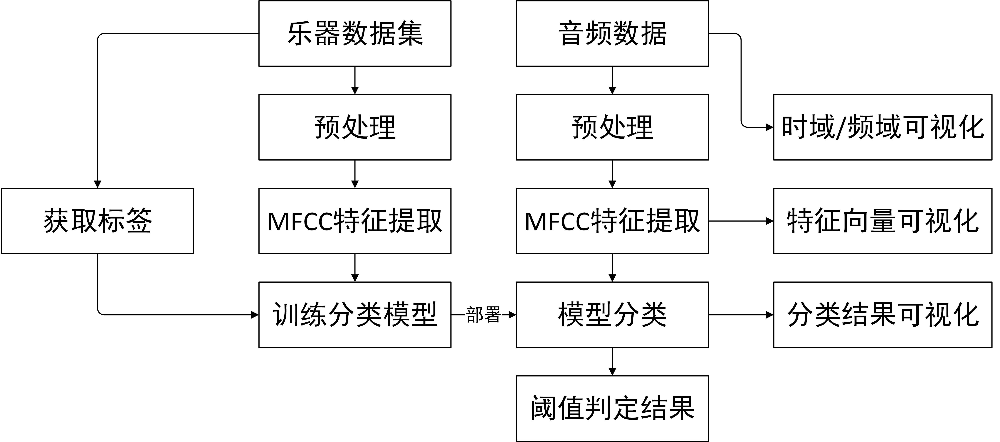
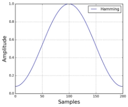

《信号与系统B（2）》课程项目

实施报告

题目：        不同乐器的音色分类和识别           

组    号：                8                     

任课教师：             张小贝                   

组    长：  19120318  洪浩天  24%   签名   

成   员：  19123826  方杜娟  18.5%   签名   

成    员：  19123834  史玉莹  18.5%   签名   

成    员：  19123870  宋心怡  18.5%   签名   

成    员：  19123902  张佳蔚  18.5%   签名   

联系方式：           15800737097            

二零二一年5月21日

1. 课程项目实施方案
   1. 题目要求与设计指标

题目要求

\1. 对三种以上乐器做机器识别。乐器包括：唢呐、钢琴、古筝、琵琶、二胡、笙等，个人从网上下载不同乐器演奏的曲目；

\2. 音频要求采样频率44kHz以上，16bits量化率以上；

\3. 针对三种以上乐器演奏相同曲子的时域、频域信息做出分析，提取音色差异的特征值，扩展到演奏不同曲目的音色差异；

\4. 提出识别不同乐器的算法，能有效识别出三种以上的乐器；

\5. 用Matlab编程实现算法和交互演示界面，能够实现通过音乐分析给出乐器名称的目的。

1. 设计思想与实现方式

根据题目要求，我们将项目实现流程划分为以下五个步骤：

1. 数据采集及预处理
1. 提取音频特征，获取特征数据
1. 设计一种基于特征向量进行音频特征分类的多分类模型并训练模型
1. 绘制GUI，时域信号/频谱/特征可视化，实现音频导入与音频播放
1. 报告撰写

以上五部分由5位组员分工完成，前期调研工作（文献资料查阅）与具体方案的决定由所有组员合作完成。保证全部组员对于项目结构与实现原理都有清晰认知。详细组员分工详见第4版块：团队分工情况。

1. 软件平台

Matlab 2019a

1. 项目的设计过程

设计总流程如下图所示：

1. 数据采集

根据题目要求，需要针对三种以上的乐器进行分类。本项目中，考虑到手动采集的数据容易因不可控制的噪音污染数据，因此我们采用由专业团队采集的高保真音频数据集作为我们的训练数据。

数据集Wavfiles of Instruments’ audio源自Kaggle，采集自GarageBand，数据在录制的过程中主动加入了噪音与间断用于避免偏差。数据格式为wav，采样率44100Hz，双通道音频。数据标签分为10类，分别为：Bass贝斯，Electrical\_Guitar电吉他，Glockenspiel钟琴，Organ风琴，Piano钢琴，Pipa琵琶，Snare\_Drum军鼓，String弦乐器，Vintage\_lead老式乐器和Violins小提琴。共有30组数据，每组数据10个标签音频文件单独存放，每个标签的音频数据时长4秒，总计300份音频文件作为数据集。

1. 音频特征提取

数据集在提取特征向量前应当进行预处理，分为2步骤：预加重，加窗分帧。

1) 预加重

语音信号的预加重，目的是为了对语音的高频部分进行加重。在求语音信号频谱时，频率越高相应的成分越小，高频部分的频谱比低频部分的难求，为此要在预处理中进行预加重（Pre-emphasis）处理。预加重的目的是提高高频部分，使信号的频谱变得平坦，保持在低频到高频的整个频带中，能用同样的信噪比求频谱，以便于频谱分析或声道参数分析。

预加重处理其实是将语音信号通过一个高通滤波器：

`           `y(t)=x(t)-ax(t-1)

其中滤波器系数a通常为或0.95或0.97,这里取alpha为0.97。

1) 加窗分帧

傅里叶变换要求输入的信号平稳，而语音信号在宏观上是不平稳的，在微观上是平稳的，具有短时平稳性（10---30ms内可以认为语音信号近似不变），这样就可以把语音信号分为一些短段来进行处理，每一个短段称为一帧（CHUNK）。

而加窗分帧的时候，不要背靠背地截取，而是相互重叠一部分。相邻两帧的起始位置的时间差叫做帧移（STRIDE）。

将信号分割成帧后，我们再对每个帧乘以一个窗函数，我们采用汉明窗，，以增加帧左端和右端的连续性。汉明窗的形式如下：

1) 特征提取

音频数据经过预处理后，我们对其进行特征提取。

我们获取到音频数据分帧后每一帧的是时域波形数据，在调研过程中我们参考了很多中提取音频特征的方法，如LSF[1]，LPC[2]，MFCC[3]等，最终采用了MFCC作为最终的特征提取方案。

在信号处理中，梅尔倒频谱（Mel-Frequency Cepstrum, MFC）系一个可用来代表短期音频的频谱，其原理基于用非线性的梅尔刻度（mel scale）表示的对数频谱及其线性余弦转换（linear cosine transform）上。

梅尔频率倒谱系数（Mel-Frequency Cepstral Coefficients, MFCC）是一组用来创建梅尔倒频谱的关键系数。由音乐信号当中的片段，可以得到一组足以代表此音乐信号之倒频谱（Cepstrum），而梅尔倒频谱系数即是从这个倒频谱中推得的倒频谱（也就是频谱的频谱）。与一般的倒频谱不同 ，梅尔倒频谱最大的特色在于，于梅尔倒频谱上的频带是均匀分布于梅尔刻度上的，也就是说，这样的频带相较于一般所看到、线性的倒频谱表示方法，和人类非线性的听觉系统更为接近。例如：在音频压缩的技术中，便常常使用梅尔倒频谱来处理。

梅尔倒频谱系数通常是用以下方法得到：

1. 将一信号进行傅里叶转换
1. 利用三角窗函数（triangular overlapping window），将频谱映射（mapping）至梅尔刻度
1. 取对数
1. 取离散余弦转换
1. MFCC是转换后的频谱

三角窗函数（又称Mel滤波器组）如下图所示：

将功率谱通过一组Mel尺度的三角带通滤波器组。这个滤波器组有M个三角带通滤波器，它们的中心频率为f(m),m=1,2,...,M。M通常取22-26，本次项目中M值取24，各f(m)之间的间隔随着m值的减小而缩小，随着m值的增大而增宽。通过三角带滤波器的目的是：对频谱进行平滑化，并消除谐波的作用，突显原先语音的共振峰。

对于音频文件的预处理与MFCC特征提取在本项目中合并在一起写入MFCC函数，用于为训练集与测试集提取特征，代码如下：

function m = MFCC(Series,Fs)

`    `alpha=0.97;

`    `bank=melbankm(24,882,Fs,0,0.5,'t');

`    `bank=full(bank);

`    `bank=bank/max(bank(:));

`    `dctcoef=zeros(12,24);

`    `for k=1:12 

`        `n=0:23;

`        `dctcoef(k,:)=cos((2\*n+1)\*k\*pi/(2\*24));

`    `end

`    `Series=filter([1 -alpha],1,Series);

`    `Series=enframe(Series,882,441); 

`    `for i=1:size(Series,1)

`        `y=Series(i,:); 

`        `s=y'.\*hamming(882);

`        `t=abs(fft(s)); 

`        `t=t.^2; 

`        `c=dctcoef\*log(bank\*t(1:442));

`        `m(i,:)=c';

`    `end

end

我们对数据集内的全部音频的双通道都分别执行了MFCC特征提取，获取235406份12维特征向量，写入data\_input.mat，与之对应的标签（此处采用one-hot编码）写入data\_output.mat。以上数据用于后续模型训练。

1. 多分类模型设计

根据题目要求所述，我们需要对三种以上的乐器做机器识别，本质上就是针对不同乐器的音频数据做多分类。前文我们针对音频数据进行了预处理，分帧并提取了特征向量。由于每一段特征向量都对应了一帧882个采样点，在44100采样率下市场20ms，足以承载足够的乐器特征信息，因此我们计划针对每一帧的特征向量设计多分类模型。

传统机器学习手段下的多分类方法包括决策树，级联SVM，KNN等，考虑到特征向量的维数较高，在决定分类模型前我们针对特征数据进行了可视化处理用于决定我们最终采取何种模型，如下图所示:

数据量的方向上依次分布10种乐器，可以从mesh网格上很明显地观测出同种乐器的MFCC具有较高的相似性，但类与类之间的区分度较小，例如第五与第六类乐器之间在低频区存在较高的相似度，不是非常适合形如knn，SVM这类基于距离手段进行分类的模型。

我们通过文献调研手段发现有一种常见的方法是对于数据进行降维。很明显MFCC的高维特征相较于低维区更为平坦，不具有较高的区分度，因而舍弃这一部分特征。此方法类似于前文中我们使用MFCC对功率谱以符合人耳特征的手段进行数据降维，属于特征工程。

自2012年AlexNet将卷积神经网络应用于图像处理以来，深度学习至今热度依旧不减，并且广泛应用于重多领域。本项目中，我们借助深度神经网络所具有的优异的泛化能力，将特征工程从手动提取转为由模型提取。此处我们借助MatLab工具包Deep Learning Toolbox，构造了15层神经网络，隐含层的激活函数采用sigmoid，输出层采用Softmax，采用交叉熵作为损失函数，训练优化采用反向传播配合Conjugate Gradient Descent共轭梯度下降实现。

训练过程中梯度变化及损失函数随epoch优化过程如下图所示：

训练结果的误差率直方图如下所示：

由图可得模型在训练集，测试集和校验集上都有着极佳的正确率，分类结果误差几乎全部分布于±5%之间，足以说明此模型在针对MFCC特征的乐器分类问题上具有极佳的可靠性。

1. GUI设计

MATLAB在2019版本之后加入了APP Designer，但本项目中我们依旧采用传统的GUIDE实现GUI界面。GUI布局结构如下：

左上角导入音频按钮按下后，回调函数执行uigetfile，即打开文件选取窗口。支持读取'\*.wav'，'\*.flac'，'\*.ogg'，'\*.au'，'\*.mp3'，'\*.mp4'共6中常见音频数据格式。读取文件后文件的完整路径将展示于按钮右侧，如下所示：

随后对获取的音频信息进行解析，调用audioread函数读取音频数据，解析音频文件名，采样率，时常与通道数等基本参数。如下图所示：

随后在右侧4个坐标区域内，分别绘制时域与频域数据。

然后计算MFCC特征向量组，并使用Panel组件与heatmap将特征向量数据可视化，支持鼠标交互用于查看特定帧的特征具体数据。当某一帧内没有音频数据，即没有数据被录制的情况下，特征向量为nan，显示为白色。

左侧两按钮“声道1”和“声道2”用于决定MFCC特征采用哪一通道作为输入数据，默认“声道1”。

中间区域放置2列表格，分别代表选定的每一帧的特征向量，与其对应的分类模型输出结果。下方tag描述经过阈值处理后对于当前选定帧的分类结果。

下方的滑动条的作用是截取用户所需要的帧。在MFCC特征的heatmap检查并获取所需的帧的位置后，可直接使用滑动条将特征向量修改为所需对应帧的特征向量，如下图所示，当前选取的是第4500帧。此滑动条另外还有作用，将在随后介绍。

最后在分类结果的右侧，窗口的中心位置垂直分布三个按钮，用于控制音频播放交互。此处采用audioplayer工具包实现音频的播放，暂停与停止。同时，对播放器绑定定时器中断（150ms）与回调函数@audio\_Callback\_func用于实时更新特征向量与预测值的数据。下方的滑动条也被设计为可以根据音频播放的时长修改拖动块的位置。

运行时整体截图如下，代码详见附录：

1. 项目的结果分析
   1. 多分类模型效果评估

针对数据集内的数据，深度神经网络模型对每一帧的特征向量分类的正确率高达95%。在训练集，测试集及校验集上的分析详见第二段多分类模型设计。但是由于深度神经网络模型的训练很大程度取决于训练集的质量，由于数据集在各乐器的数据上并没有提供足够的多样性，因此当把模型部署于外部音频数据的时候出现了一定偏差。经多次尝试不同的神经网络层数我们发现，层数过多的深度神经网络易导致过拟合问题，此处将模型的网络层数减小，修改为5层，很好地改善了分类质量，能够数据集以外的音频文件中的乐器的识别准确率。

当某一帧的音频是由多种乐器声音叠加产生，分类模型的输出结果容易产生一定偏差。例如在乐曲《乘着歌的翅膀》中，存在大量小提琴与钢琴叠加的部分，此处分类结果就不尽人意。同时由于String分类与Violin存在较高的相似性，容易出现错分。

针对声音混叠问题，我们采用“双阈值”方法进行处理。当模型输出的结果中最大值超过0.5，那判定分类为此标签，当输出结果中的最大值大于0.3但小于0.5，同时次大值大于0.1，则同时判定输出最大与次大值，次大值写在括号中，当最大值小于0.3，则判定分类失效，输出‘Unknown’。以此改善声音混叠问题。

1. GUI界面效果分析

GUI界面为用户提供了直观的观察途径。用户通过界面键入命令，程序执行后的结果由界面显示给用户。在进行GUI界面设计时，我们尽可能地在满足要求的情况下将其设计得简洁明了、包含性广，然而界面设计并非绝对完美，在导入较大的音频文件时，由于matlab的Audioread函数一次性将全部音频读入内存，速度较慢，因此在加载过程中出现了一定卡顿。同时MFCC频谱在绘制与交互的过程中由于数据量较大，在时长较长的音频交互过程中容易发生卡顿现象。

针对音频读取卡顿的问题，我们在音频信息栏写入loading用以提示使用者加载状态。在全部数据加载完成前，音频的详细数据将不会展示，使用loading替代，以此告知使用者，如下图所示：

1. 团队分工情况

组长：  洪浩天 负责多分类模型设计，部分GUI程序设计及部分报告撰写

成员：  方杜娟 负责音频特征提取

成员：  史玉莹 负责主要部分程序设计

成员：  宋心怡 负责音频特征提取

成员：  张佳蔚 负责报告撰写

1. 参考文献及源程序

[1] "The Computation of Line Spectral Frequencies Using Chebyshev Polynomials" P. Kabal and R. P. Ramachandran. IEEE Trans. Acoustics, Speech, Signal Processing, vol. 34, no. 6, pp. 1419–1426, Dec. 1986.

[2] Deng, Li; Douglas O'Shaughnessy (2003). Speech processing: a dynamic and optimization-oriented approach. Marcel Dekker. pp. 41–48. ISBN 978-0-8247-4040-5.

[3] Davis, S. Mermelstein, P. (1980) Comparison of Parametric Representations for Monosyllabic Word Recognition in Continuously Spoken Sentences. In IEEE Transactions on Acoustics, Speech, and Signal Processing, Vol. 28 No. 4, pp. 357-366

1. MFCC.m

function m = MFCC(Series,Fs)

`    `alpha=0.97;

`    `bank=melbankm(24,882,Fs,0,0.5,'t');

`    `bank=full(bank);

`    `bank=bank/max(bank(:));

`    `dctcoef=zeros(12,24);

`    `for k=1:12 

`        `n=0:23;

`        `dctcoef(k,:)=cos((2\*n+1)\*k\*pi/(2\*24));

`    `end

`    `Series=filter([1 -alpha],1,Series);

`    `Series=enframe(Series,882,441); 

`    `for i=1:size(Series,1)

`        `y=Series(i,:);

`        `s=y'.\*hamming(882); 

`        `t=abs(fft(s));

`        `t=t.^2; 

`        `c=dctcoef\*log(bank\*t(1:442)); 

`        `m(i,:)=c';

`    `end

end

1. GETMax.m

function result = GETMax(in)

`    `labellist={'Bass','Electric\_Guitar','Glockenspiel ','Organ','Piano','Pipa','Snare\_Drum','String','Vintage\_lead','Violins'};

`    `if isnan(in(1))

`        `result='none';

`        `return;

`    `else

`        `[m,p]=max(in);

`        `in(p)=0;

`        `[n,p2]=max(in);

`        `if(m>0.5)

`            `result=labellist{p};

`        `elseif(m>0.3 && n>=0.1)

`            `result=labellist{p}+" ("+labellist{p2}+")";

`        `elseif(m>0.3)

`            `result=labellist{p};

`        `else

`            `result='Unknown';

`        `end

`        `return;

`    `end

end

1. APP.m

function varargout = APP(varargin)

%APP MATLAB code file for APP.fig

%      APP, by itself, creates a new APP or raises the existing

%      singleton\*.

%

%      H = APP returns the handle to a new APP or the handle to

%      the existing singleton\*.

%

%      APP('Property','Value',...) creates a new APP using the

%      given property value pairs. Unrecognized properties are passed via

%      varargin to APP\_OpeningFcn.  This calling syntax produces a

%      warning when there is an existing singleton\*.

%

%      APP('CALLBACK') and APP('CALLBACK',hObject,...) call the

%      local function named CALLBACK in APP.M with the given input

%      arguments.

%

%      \*See GUI Options on GUIDE's Tools menu.  Choose "GUI allows only one

%      instance to run (singleton)".

%

% See also: GUIDE, GUIDATA, GUIHANDLES

% Edit the above text to modify the response to help APP

% Last Modified by GUIDE v2.5 26-Apr-2021 09:21:05

% Begin initialization code - DO NOT EDIT

gui\_Singleton = 1;

gui\_State = struct('gui\_Name',       mfilename, ...

`                   `'gui\_Singleton',  gui\_Singleton, ...

`                   `'gui\_OpeningFcn', @APP\_OpeningFcn, ...

`                   `'gui\_OutputFcn',  @APP\_OutputFcn, ...

`                   `'gui\_LayoutFcn',  [], ...

`                   `'gui\_Callback',   []);

if nargin && ischar(varargin{1})

`   `gui\_State.gui\_Callback = str2func(varargin{1});

end

if nargout

`    `[varargout{1:nargout}] = gui\_mainfcn(gui\_State, varargin{:});

else

`    `gui\_mainfcn(gui\_State, varargin{:});

end

% End initialization code - DO NOT EDIT

% --- Executes just before APP is made visible.

function APP\_OpeningFcn(hObject, eventdata, handles, varargin)

% This function has no output args, see OutputFcn.

% hObject    handle to figure

% eventdata  reserved - to be defined in a future version of MATLAB

% handles    structure with handles and user data (see GUIDATA)

% varargin   unrecognized PropertyName/PropertyValue pairs from the

%            command line (see VARARGIN)6

% Choose default command line output for APP

handles.output = hObject;

% Update handles structure

guidata(hObject, handles);

% UIWAIT makes APP wait for user response (see UIRESUME)

% uiwait(handles.figure1);

% --- Outputs from this function are returned to the command line.

function varargout = APP\_OutputFcn(hObject, eventdata, handles)

% varargout  cell array for returning output args (see VARARGOUT);

% hObject    handle to figure

% eventdata  reserved - to be defined in a future version of MATLAB

% handles    structure with handles and user data (see GUIDATA)

% Get default command line output from handles structure

varargout{1} = handles.output;

global filename file\_loc Channel\_num flagpause x Fs Frame framelen Channel m featureVec hd time Player prediction labellist;

Channel\_num=1;

flagpause=0;

Channel=1;

time=0;

filename='';

file\_loc='';

x=[];

Fs=44100;

Frame=1;

framelen=1;

m=[];

prediction=zeros(12,1);

featureVec=zeros(12,1);

Player=[];

hd=handles;

Label={'·ÖÀàÊä³ö';'Bass:';'Electric\_Guitar:';'Glockenspiel:';'Organ:';'Piano:';'Pipa:';'Snare\_Drum:';'String:';'Vintage\_lead:';'Violins:'};

set(handles.TextLabel,'string',Label);

% --- Executes on button press in pushbutton1.

function pushbutton1\_Callback(hObject, eventdata, handles)

% hObject    handle to pushbutton1 (see GCBO)

% eventdata  reserved - to be defined in a future version of MATLAB

% handles    structure with handles and user data (see GUIDATA)

global filename file\_loc x Fs Frame framelen Channel m Channel\_num prediction Player labellist;

[filename filepath]=uigetfile({'\*.wav';'\*.flac';'\*.ogg';'\*.au';'\*.mp3';'\*.mp4'},'µ¼ÈëÒôƵÎļþ');

if(filename~=0)

`    `file\_loc=[filepath filename]

`    `set(handles.text\_fileloc,'string',file\_loc);

`    `information={'ÒôƵÐÅÏ¢';['ÎļþÃû£º',filename];'Loading...'};

`    `set(handles.text\_information,'string',information);

`    `[x,Fs]=audioread(file\_loc);

`    `Player=audioplayer(x,Fs);

`    `set(Player,'TimerPeriod',441/Fs\*15);

`    `set(Player,'TimerFcn',@audio\_Callback\_func);

`    `s=size(x);

`    `Channel\_num=num2str(s(2));

`    `information={'ÒôƵÐÅÏ¢';['ÎļþÃû£º',filename];['²ÉÑùÂÊ£º',num2str(Fs)];['ʱ³¤£º',num2str(s(1)/Fs),'s'];...

`        `['ͨµÀÊý£º',Channel\_num]};

`    `timeax=1/Fs:1/Fs:s(1)/Fs;

`    `if(Channel\_num-1)

`        `plot(handles.axes\_raw1,timeax,x(:,1));

`        `plot(handles.axes\_raw2,timeax,x(:,2),'-r');

`        `plot(handles.axes\_FFT1,abs(AverageFFT(x(:,1),Fs)));

`        `plot(handles.axes\_FFT2,abs(AverageFFT(x(:,2),Fs)),'-r');

`    `else

`        `set(handles.BUTTON\_Channel2,'enable','off');

`        `set(handles.text\_information,'string',information);

`        `plot(handles.axes\_raw1,timeax,x(:,1));

`        `plot(handles.axes\_FFT1,abs(AverageFFT(x(:,1),Fs)));

`    `end

`    `m=MFCC(x(:,Channel),Fs);

`    `framelen=numel(m)/12;

`    `Frame=1;

`    `set(handles.slider1,'Max',framelen,'Min',1,'Value',1,'sliderstep',[1,0.05]);

`    `heatmap(handles.panel\_mfcc,m.','XLabel','Ö¡','YLabel','ÌØÕ÷ÏòÁ¿','GridVisible','off','Colormap',autumn,'MissingDataColor','White');

`    `set(handles.text\_Frameid,'String',['Frame=',num2str(Frame)]);

`    `feature=m(Frame,:)

`    `set(handles.FeatureTable,'data',feature.');

`    `prediction=MusicClassifier(feature);

`    `set(handles.PredictionTab,'data',prediction.');

`    `result=GETMax(prediction);

`    `clinf={'µ¥Ö¡·ÖÀà½á¹û£º';result};

`    `set(handles.ClassResult,'string',clinf);

`    `set(handles.text\_information,'string',information);

end

% --- Executes during object creation, after setting all properties.

function pushbutton1\_CreateFcn(hObject, eventdata, handles)

% hObject    handle to pushbutton1 (see GCBO)

% eventdata  reserved - to be defined in a future version of MATLAB

% handles    empty - handles not created until after all CreateFcns called

% --- Executes on slider movement.

function slider1\_Callback(hObject, eventdata, handles)

% hObject    handle to slider1 (see GCBO)

% eventdata  reserved - to be defined in a future version of MATLAB

% handles    structure with handles and user data (see GUIDATA)

global Frame m prediction;

Frame=floor(get(hObject,'Value'));

set(handles.text\_Frameid,'String',['Frame=',num2str(Frame)]);

set(handles.FeatureTable,'data',m(Frame,:).');

prediction=MusicClassifier(m(Frame,:));

set(handles.PredictionTab,'data',prediction.');

result=GETMax(prediction);

clinf={'µ¥Ö¡·ÖÀà½á¹û£º';result};

set(handles.ClassResult,'string',clinf);

% Hints: get(hObject,'Value') returns position of slider

%        get(hObject,'Min') and get(hObject,'Max') to determine range of slider

% --- Executes during object creation, after setting all properties.

function slider1\_CreateFcn(hObject, eventdata, handles)

% hObject    handle to slider1 (see GCBO)

% eventdata  reserved - to be defined in a future version of MATLAB

% handles    empty - handles not created until after all CreateFcns called

% Hint: slider controls usually have a light gray background.

if isequal(get(hObject,'BackgroundColor'), get(0,'defaultUicontrolBackgroundColor'))

`    `set(hObject,'BackgroundColor',[.9 .9 .9]);

end

% --- Executes on button press in BUTTON\_Channel1.

function BUTTON\_Channel1\_Callback(hObject, eventdata, handles)

% hObject    handle to BUTTON\_Channel1 (see GCBO)

% eventdata  reserved - to be defined in a future version of MATLAB

% handles    structure with handles and user data (see GUIDATA)

global Channel x Fs m Frame prediction;

Channel=1;

m=MFCC(x(:,Channel),Fs);

heatmap(handles.panel\_mfcc,m.','XLabel','Ö¡','YLabel','ÌØÕ÷ÏòÁ¿','GridVisible','off','Colormap',autumn,'MissingDataColor','White');

set(handles.FeatureTable,'data',m(Frame,:).');

prediction=MusicClassifier(m(Frame,:));

set(handles.PredictionTab,'data',prediction.');

result=GETMax(prediction);

clinf={'µ¥Ö¡·ÖÀà½á¹û£º';result};

set(handles.ClassResult,'string',clinf);

% --- Executes on button press in BUTTON\_Channel2.

function BUTTON\_Channel2\_Callback(hObject, eventdata, handles)

% hObject    handle to BUTTON\_Channel2 (see GCBO)

% eventdata  reserved - to be defined in a future version of MATLAB

% handles    structure with handles and user data (see GUIDATA)

global Channel x Fs m Frame Channel\_num;

if Channel\_num-1

`    `Channel=2;

else

`    `Channel=1;

end

m=MFCC(x(:,Channel),Fs);

heatmap(handles.panel\_mfcc,m.','XLabel','Ö¡','YLabel','ÌØÕ÷ÏòÁ¿','GridVisible','off','Colormap',autumn,'MissingDataColor','White');

set(handles.FeatureTable,'data',m(Frame,:).');

prediction=MusicClassifier(m(Frame,:));

set(handles.PredictionTab,'data',prediction.');

result=GETMax(prediction);

clinf={'µ¥Ö¡·ÖÀà½á¹û£º';result};

set(handles.ClassResult,'string',clinf);

% --- Executes during object creation, after setting all properties.

function FeatureVec\_CreateFcn(hObject, eventdata, handles)

% hObject    handle to FeatureVec (see GCBO)

% eventdata  reserved - to be defined in a future version of MATLAB

% handles    empty - handles not created until after all CreateFcns called

% --- Executes on button press in PlayButton.

function PlayButton\_Callback(hObject, eventdata, handles)

% hObject    handle to PlayButton (see GCBO)

% eventdata  reserved - to be defined in a future version of MATLAB

% handles    structure with handles and user data (see GUIDATA)

global Player time flagpause;

if(flagpause==0)

`    `time=0;

`    `play(Player);

else

`    `resume(Player);

`    `flagpause=1;

end

function audio\_Callback\_func(hObject, eventdata, handles)

global time prediction m hd Frame framelen;

if(time>=framelen)

`    `time=0;

`    `stop(Player);

end

Frame=time;

time=time+15;

disp(Frame);

predict\_whole=zeros(1,10);

for i=(Frame-15):Frame

`    `feature=m(i,:);

`    `predict\_whole=predict\_whole+MusicClassifier5(feature)/15;

end

%feature=m(Frame,:)

set(hd.FeatureTable,'data',feature.');

prediction=predict\_whole;

%prediction=MusicClassifier5(feature);

set(hd.PredictionTab,'data',prediction.');

set(hd.slider1,'Value',Frame);

set(hd.text\_Frameid,'String',['Frame=',num2str(Frame)]);

result=GETMax(prediction);

clinf={'µ¥Ö¡·ÖÀà½á¹û£º';result};

set(hd.ClassResult,'string',clinf);

% --- Executes on button press in PauseButton.

function PauseButton\_Callback(hObject, eventdata, handles)

% hObject    handle to PauseButton (see GCBO)

% eventdata  reserved - to be defined in a future version of MATLAB

% handles    structure with handles and user data (see GUIDATA)

global Player time flagpause;

pause(Player);

flagpause=1;

% --- Executes on button press in PauseButton.

function StopButton\_Callback(hObject, eventdata, handles)

% hObject    handle to PauseButton (see GCBO)

% eventdata  reserved - to be defined in a future version of MATLAB

% handles    structure with handles and user data (see GUIDATA)

global Player time;

stop(Player);

time=0;

**附件二   课程项目题目**

不同乐器的音色分类和识别

**设计要求**

1. 对三种以上乐器做机器识别。乐器包括：唢呐、钢琴、古筝、琵琶、二胡、笙等，个人从网上下载不同乐器演奏的曲目；
1. 音频要求采样频率44kHz以上，16bits量化率以上；
1. 针对三种以上乐器演奏相同曲子的时域、频域信息做出分析，提取音色差异的特征值，扩展到演奏不同曲目的音色差异；
1. 提出识别不同乐器的算法，能有效识别出三种以上的乐器；
1. 用Matlab编程实现算法和交互演示界面，能够实现通过音乐分析给出乐器名称的目的。

**评分依据**

1. 功能实现：Matlab读取音频文件和音频相关的信息，时域波形和频谱展示图，交互演示界面等；
1. 性能指标：算法实现，算法的准确性评估；
1. 工程规范（软件规范、可靠性等）：Matlab软件的使用，整个过程重复再现性、周全性、稳健性等设计；
1. 理论水平：方案设计简单合理，分析计算过程清晰；
1. 团队分工合作情况。

